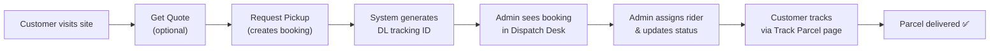
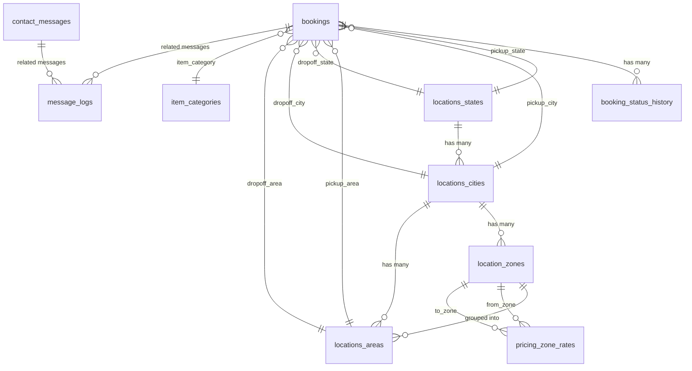
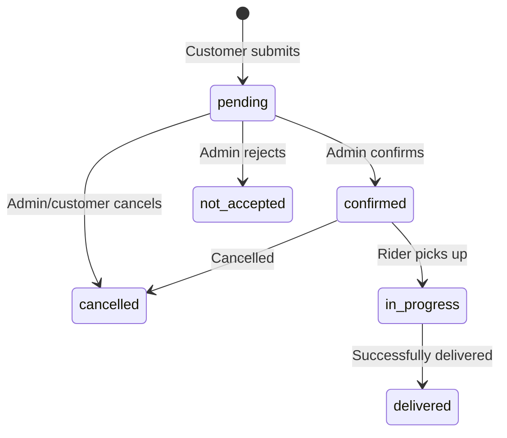
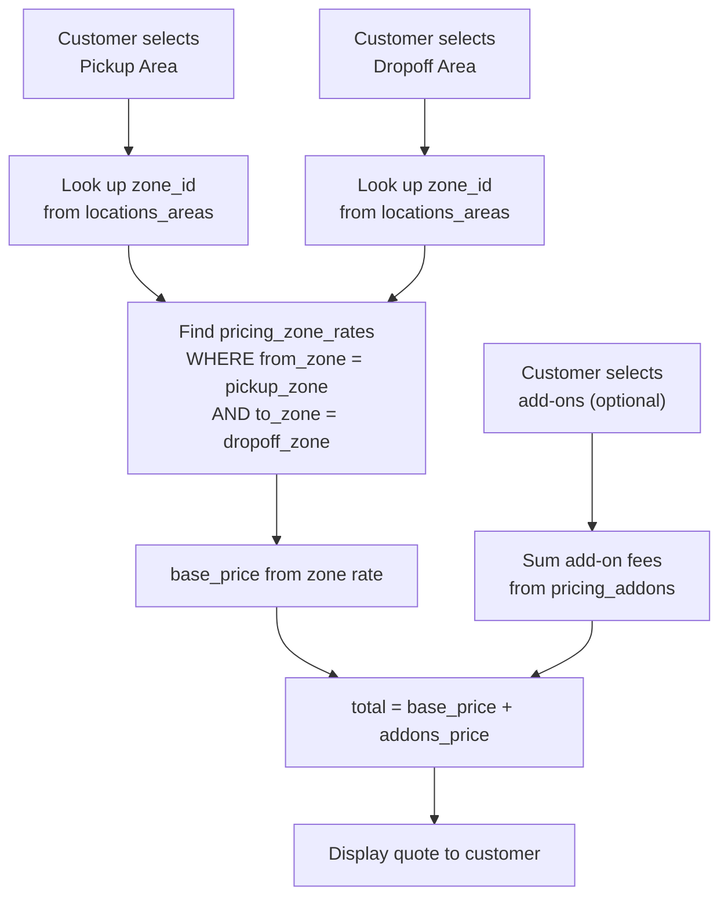
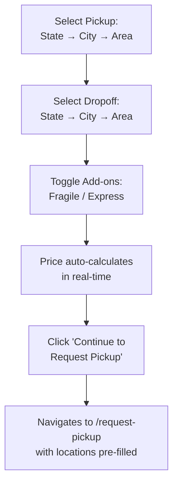

# Dolu Logistics — Developer Specification

> **Project:** Dolu Logistics Dispatch & Tracking System  
> **Repo:** `dolulogistics2`  
> **Package name:** `swifthaul-express` (legacy name in `package.json`)  
> **Version:** 0.1.0  
> **Generated:** 2026-04-01

---

## Table of Contents

1. [High-Level Overview](#1-high-level-overview)
2. [Tech Stack](#2-tech-stack)
3. [Project Structure](#3-project-structure)
4. [Environment & Configuration](#4-environment--configuration)
5. [Database Schema (Supabase/Postgres)](#5-database-schema)
   - [Migration 001 – Locations](#migration-001--locations)
   - [Migration 002 – Pricing](#migration-002--pricing)
   - [Migration 003 – Item Categories](#migration-003--item-categories)
   - [Migration 004 – Bookings](#migration-004--bookings)
   - [Migration 005 – Contact Messages](#migration-005--contact-messages)
   - [Migration 006 – Settings & Templates](#migration-006--settings--templates)
   - [Migration 007 – Message Logs](#migration-007--message-logs)
   - [Migration 008 – Indexes & Functions](#migration-008--indexes--functions)
6. [Pricing Engine — How It Works](#6-pricing-engine)
7. [Application Flow (Customer Side)](#7-application-flow-customer-side)
8. [Application Flow (Admin Side)](#8-application-flow-admin-side)
9. [File-by-File Breakdown](#9-file-by-file-breakdown)
   - [Entry & Config](#entry--config)
   - [Layout Components](#layout-components)
   - [Utility Layers](#utility-layers)
   - [Type Definitions](#type-definitions)
   - [Public Pages](#public-pages)
   - [Admin Pages](#admin-pages)
10. [Routing Map](#10-routing-map)
11. [Authentication Model](#11-authentication-model)
12. [Security (RLS Policies)](#12-security-rls-policies)
13. [Design System](#13-design-system)
14. [Key Design Decisions](#14-key-design-decisions)

---

## 1. High-Level Overview

Dolu Logistics is a **parcel dispatch and tracking web application** for a logistics company based in **Port Harcourt, Rivers State, Nigeria**. It has two halves:

| Side | Purpose |
|------|---------|
| **Customer-facing website** | Browse services, get instant price quotes, request pickup, track parcels, contact support |
| **Admin panel** | Manage bookings (Dispatch Desk), view contact messages, configure pricing/zones, edit SMS/email/WhatsApp templates, configure app settings |

### The Core Business Flow



---

## 2. Tech Stack

| Layer | Technology | Notes |
|-------|-----------|-------|
| **Framework** | React 18 + TypeScript | Single-page application |
| **Build Tool** | Vite 5 | Dev server + production bundler |
| **Styling** | TailwindCSS 3.4 | Custom brand color palette |
| **Animations** | Framer Motion 10 | Page transitions, entrance animations |
| **Routing** | React Router DOM 6 | Client-side routing with nested layouts |
| **Backend/DB** | Supabase (hosted Postgres) | Auth, database, RLS, RPC functions |
| **Icons** | Lucide React | Consistent icon library |
| **Notifications** | React Toastify | Toast notifications for user feedback |
| **QR Codes** | react-qr-code | For tracking ID QR generation |
| **Deployment** | GitHub Pages (planned) | `homepage` field in package.json |

---

## 3. Project Structure

```
dolulogistics2/
├── .env                          # Supabase credentials
├── index.html                    # Vite entry HTML
├── package.json                  # Dependencies & scripts
├── tailwind.config.js            # Brand colors, fonts, shadows
├── vite.config.ts                # Vite + React plugin config
├── tsconfig.json / tsconfig.app.json / tsconfig.node.json
│
├── supabase/
│   └── migrations/               # 8 SQL migration files (run in order)
│       ├── 001_create_locations_tables.sql
│       ├── 002_create_pricing_tables.sql
│       ├── 003_create_item_categories.sql
│       ├── 004_create_bookings_tables.sql
│       ├── 005_create_contact_messages_table.sql
│       ├── 006_create_settings_and_templates.sql
│       ├── 007_create_message_logs.sql
│       └── 008_additional_indexes_constraints.sql
│
└── src/
    ├── main.tsx                   # App entry point
    ├── App.tsx                    # Router + route definitions
    ├── index.css                  # Global Tailwind imports
    ├── vite-env.d.ts              # Vite type declarations
    │
    ├── assets/images/             # Static images (logo, branding)
    │
    ├── lib/
    │   └── supabase.ts            # Supabase client singleton
    │
    ├── types/
    │   ├── database.ts            # All TypeScript interfaces for DB tables
    │   └── supabase.ts            # Legacy type definitions (older schema)
    │
    ├── utils/
    │   ├── bookings.ts            # Booking CRUD, tracking ID generation
    │   ├── locations.ts           # Location fetching + dropdown helpers
    │   └── pricing.ts             # Price calculation engine
    │
    ├── components/
    │   ├── common/
    │   │   └── ScrollToTop.tsx     # Auto-scroll on route change
    │   └── layout/
    │       ├── Layout.tsx          # Customer layout (Navbar + Footer)
    │       ├── AdminLayout.tsx     # Admin layout (sidebar + header)
    │       ├── Navbar.tsx          # Customer navigation bar
    │       └── Footer.tsx          # Customer footer
    │
    └── pages/
        ├── NotFoundPage.tsx        # 404 page
        ├── home/
        │   ├── HomePage.tsx        # Landing page
        │   └── components/
        │       ├── HeroSection.tsx
        │       ├── HowItWorks.tsx
        │       ├── ServiceHighlights.tsx
        │       └── Testimonials.tsx
        ├── track/
        │   ├── TrackPage.tsx       # Old track page (unused)
        │   └── NewTrackPage.tsx    # Active track page
        ├── quote/
        │   └── GetQuotePage.tsx    # Instant price quote
        ├── request/
        │   ├── RequestPickupPage.tsx    # Old version (unused)
        │   └── NewRequestPickupPage.tsx # Active booking form
        ├── services/
        │   ├── ServicesPage.tsx    # Services listing
        │   └── components/
        │       └── ServiceCard.tsx
        ├── about/
        │   └── AboutPage.tsx      # About Dolu Logistics
        ├── contact/
        │   └── ContactPage.tsx    # Contact form → saves to DB
        └── admin/
            ├── AdminLogin.tsx      # Password-based login
            ├── AdminDashboard.tsx   # Stats overview
            ├── AdminBookings.tsx    # Dispatch Desk (manage bookings)
            ├── AdminMessages.tsx    # Contact message inbox
            ├── AdminPricing.tsx     # Zone rate & addon management
            ├── AdminTemplates.tsx   # SMS/Email/WhatsApp templates
            ├── AdminSettings.tsx    # App configuration
            ├── AdminRequests.tsx    # Legacy (may be unused)
            └── components/         # Admin sub-components
```

---

## 4. Environment & Configuration

### `.env` (Vite environment variables)
```
VITE_SUPABASE_URL=https://dfhxjbxemmwczjmyleyx.supabase.co
VITE_SUPABASE_ANON_KEY=sb_publishable_GVYHdEkHpbn_kqVXznTHNQ_dSjbryGD
```

- Prefixed with `VITE_` so Vite exposes them to client-side code
- `supabase.ts` in `src/lib/` creates a singleton client from these values

### `tailwind.config.js` — Design Tokens

| Token | Value | Usage |
|-------|-------|-------|
| `primary-500` | `#1558B0` | Main brand blue |
| `accent-400` | `#A6E22E` | Lemon/electric green (from logo) |
| `background` | `#F7FAFF` | Cool blue-white page background |
| `text` | `#0F172A` | Body text (blue-tinted dark) |
| Font | `Inter` | Google Font, applied globally |

---

## 5. Database Schema

The database is Supabase-hosted PostgreSQL with **8 migrations** that must run in order. Every table has:
- UUID primary keys (`gen_random_uuid()`)
- `created_at` and `updated_at` timestamps (auto-managed via triggers)
- Row Level Security (RLS) enabled
- Partial indexes for performance

### Entity Relationship Diagram



---

### Migration 001 – Locations

**File:** `001_create_locations_tables.sql`  
**Purpose:** Hierarchical location system for zone-based pricing.

| Table | Purpose | Key Fields |
|-------|---------|------------|
| `locations_states` | Nigerian states | `name`, `code` (e.g., `NG-RI`), `active` |
| `locations_cities` | Cities within states | `state_id` (FK), `name`, `active` |
| `location_zones` | Pricing zones per city | `city_id` (FK), `name` (e.g., "Zone A"), `description` |
| `locations_areas` | Specific neighborhoods | `city_id` (FK), `zone_id` (FK, nullable), `name` |

**Seed Data:**
- **Rivers State** → **Port Harcourt** city
- 3 zones: Zone A (city center), Zone B (mid-range), Zone C (outer)
- 20 areas assigned to zones (D-Line, Rumuola, GRA Phase 1, Eliozu, Choba, etc.)

**RLS Rules:**
- ✅ Public can **read** active records (powers customer dropdowns)
- 🔒 Only authenticated users can **insert/update/delete**

**How it works in the app:**  
When a customer fills the Get Quote or Request Pickup form, they select State → City → Area using cascading dropdowns. Each dropdown loads from these tables.

---

### Migration 002 – Pricing

**File:** `002_create_pricing_tables.sql`  
**Purpose:** Zone-to-zone delivery rates and optional add-on fees.

| Table | Purpose | Key Fields |
|-------|---------|------------|
| `pricing_zone_rates` | Base price between two zones | `from_zone_id`, `to_zone_id`, `base_price`, `eta_text` |
| `pricing_addons` | Additional service fees | `name`, `code`, `fee` (e.g., "Fragile" = ₦300) |

**Seed Data — Zone Rates (Port Harcourt):**

| From | To | Price (₦) | ETA |
|------|----|-----------|-----|
| Zone A | Zone A | 800 | 30-45 min |
| Zone A | Zone B | 1,200 | 45-60 min |
| Zone A | Zone C | 1,500 | 60-90 min |
| Zone B | Zone A | 1,200 | 45-60 min |
| Zone B | Zone B | 1,000 | 30-45 min |
| Zone B | Zone C | 1,300 | 45-60 min |
| Zone C | Zone A | 1,500 | 60-90 min |
| Zone C | Zone B | 1,300 | 45-60 min |
| Zone C | Zone C | 1,200 | 30-60 min |

**Seed Data — Add-ons:**

| Add-on | Code | Fee |
|--------|------|-----|
| Fragile Handling | `FRAGILE` | ₦300 |
| Express Delivery | `EXPRESS` | ₦500 |

> [!IMPORTANT]
> Rates are **directional** — Zone A→B can have a different price than Zone B→A.

---

### Migration 003 – Item Categories

**File:** `003_create_item_categories.sql`  
**Purpose:** Standardized list of what customers are shipping.

| Category | Code | Requires Notes? |
|----------|------|-----------------|
| Documents | `DOCUMENTS` | No |
| Food Items | `FOOD` | No |
| Electronics/Gadgets | `ELECTRONICS` | No |
| Fashion/Clothing | `FASHION` | No |
| Cosmetics | `COSMETICS` | No |
| Gifts/Packages | `GIFTS` | No |
| Household Items | `HOUSEHOLD` | No |
| Other | `OTHER` | **Yes** — must describe |

Shown as a dropdown in the Request Pickup form. When "Other" is selected, the notes field becomes required.

---

### Migration 004 – Bookings

**File:** `004_create_bookings_tables.sql`  
**Purpose:** Core booking records and status tracking history.

#### `bookings` table

| Field Group | Fields | Notes |
|-------------|--------|-------|
| **Tracking** | `tracking_id` | Unique, auto-generated: `DL` + `YYYYMMDD` + 3-digit seq |
| **Sender** | `sender_name`, `sender_phone`, `sender_whatsapp` | ⚠️ NO email field (by design) |
| **Pickup** | `pickup_state_id`, `pickup_city_id`, `pickup_area_id`, `pickup_address`, `pickup_landmark` | FKs to location tables |
| **Receiver** | `receiver_name`, `receiver_phone`, `receiver_whatsapp` | ⚠️ NO email field (by design) |
| **Dropoff** | `dropoff_state_id`, `dropoff_city_id`, `dropoff_area_id`, `dropoff_address`, `dropoff_landmark` | FKs to location tables |
| **Item** | `item_category_id`, `item_notes` | FK to item_categories |
| **Pricing** | `price_base`, `price_addons`, `price_total`, `addons_selected` | Snapshot at booking time |
| **Rider** | `rider_name`, `rider_phone` | Simple text fields (no rider table) |
| **Status** | `status` | Enum: see below |
| **Admin** | `admin_notes` | Internal only |

#### Booking Status Flow



#### `booking_status_history` table

Every status change creates a history entry. This powers the **Track Parcel timeline**.

| Field | Purpose |
|-------|---------|
| `booking_id` | FK to bookings |
| `status` | What status it changed to |
| `note` | Human-readable description (e.g., "Booking received. Customer care will call you shortly.") |
| `created_by` | `'system'` or `'admin'` |

#### `generate_tracking_id()` — Postgres Function

- Format: `DL` + `YYYYMMDD` + 3-digit sequential number
- Example: `DL20240209001`, `DL20240209002`, ...
- Loops to ensure uniqueness
- Called via `supabase.rpc('generate_tracking_id')` from the frontend

---

### Migration 005 – Contact Messages

**File:** `005_create_contact_messages_table.sql`  
**Purpose:** Messages submitted from the Contact page.

| Field | Purpose |
|-------|---------|
| `name` | Customer name (required) |
| `email`, `phone`, `whatsapp` | Optional contact methods |
| `subject` | Optional subject line |
| `message` | Full message text (required) |
| `status` | `new` → `in_progress` → `resolved` or `spam` |
| `admin_notes` | Internal notes |

**RLS:**
- ✅ Public can **insert** (submit the form)
- 🔒 Only authenticated users can **read/update/delete**

---

### Migration 006 – Settings & Templates

**File:** `006_create_settings_and_templates.sql`  
**Purpose:** Global app configuration and message templates.

#### `settings_app` — Key-Value Store

| Key | Default Value | Purpose |
|-----|---------------|---------|
| `customer_care_phone` | `+234 913 027 8580` | Shown on tracking page |
| `customer_care_whatsapp` | `+234 913 027 8580` | WhatsApp link target |
| `business_hours_text` | `Mon-Fri: 8:30-5:00, Sat: 9:00-5:00` | Displayed on contact page |
| `admin_emails` | `["admin@dolulogistics.com"]` | Email notification recipients |
| `email_on_new_booking` | `true` | Email admin on new booking? |
| `email_on_new_contact_message` | `true` | Email admin on new contact? |
| `sms_enabled` | `false` | Master SMS toggle |
| `sms_send_mode` | `manual_only` | `manual_only` or `auto_on_in_progress` |
| `sms_provider` | `termii` | SMS provider name |
| `sms_api_key` | `""` | Provider API key |
| `sms_sender_name` | `DoluLog` | Sender display name |

> [!NOTE]
> SMS is **manual by default**. Admin must click "Send Tracking SMS" — this prevents accidental costs.

#### `message_templates` — SMS/WhatsApp/Email Templates

Templates support **placeholders** like `{tracking_id}`, `{sender_name}`, `{customer_care_phone}`, etc.

| Template | Type | Purpose |
|----------|------|---------|
| Tracking SMS | `sms` | Sent when admin clicks "Send Tracking SMS" |
| Tracking WhatsApp | `whatsapp` | WhatsApp version of tracking message |
| New Booking Email | `email` | Notifies admin of new booking |
| New Contact Message Email | `email` | Notifies admin of new contact message |

---

### Migration 007 – Message Logs

**File:** `007_create_message_logs.sql`  
**Purpose:** Append-only audit trail for all SMS/Email/WhatsApp messages sent.

| Field | Purpose |
|-------|---------|
| `message_type` | `sms`, `email`, or `whatsapp` |
| `recipient` | Phone or email |
| `booking_id` | Optional FK |
| `template_code` | Which template was used |
| `body` | Full message after placeholder substitution |
| `status` | `pending`, `sent`, or `failed` |
| `error_message` | Error details if failed |
| `cost` | SMS cost tracking |
| `triggered_by` | `admin`, `system`, or `auto` |

> [!IMPORTANT]
> Logs are **immutable** — no updates or deletes by design. This ensures audit integrity.

---

### Migration 008 – Indexes & Functions

**File:** `008_additional_indexes_constraints.sql`  
**Purpose:** Performance optimizations, data validation, and helper functions.

**Key additions:**

1. **`update_updated_at_column()` trigger** — Auto-updates `updated_at` on every table when a row is modified

2. **Data validation constraints:**
   - Tracking ID must match `^DL[0-9]{11}$`
   - All prices must be ≥ 0
   - Addon fees must be ≥ 0

3. **`get_price_quote()` Postgres function** — Server-side pricing calculation:
   - Takes `pickup_area_id`, `dropoff_area_id`, `addon_codes[]`
   - Looks up zones from areas → finds rate → adds addons → returns JSONB result
   - (Currently the frontend calculates pricing client-side instead of using this)

4. **Composite indexes** for common queries:
   - Bookings by status + date (admin dashboard)
   - Zone rates lookup (pricing calculator)
   - Contact messages by status + date

---

## 6. Pricing Engine

### How Pricing Works (Step by Step)



### Implementation

The pricing logic lives in `src/utils/pricing.ts`:

1. **`calculatePriceQuote(pickupAreaId, dropoffAreaId, addonCodes[])`**
   - Queries `locations_areas` for each area's `zone_id`
   - Queries `pricing_zone_rates` for the from→to zone rate
   - Queries `pricing_addons` for selected addon fees
   - Returns `{ success, base_price, addons_price, total_price, eta_text }`

2. **`fetchAddons()`** — Returns all active add-ons for the form checkboxes

3. **`formatPrice(price)`** — Formats as `₦1,200.00` (Nigerian Naira)

> [!NOTE]
> Prices are calculated **client-side** using Supabase queries. When a booking is created, the calculated price is saved as a **snapshot** — this means historical bookings preserve their original price even if rates change later.

---

## 7. Application Flow (Customer Side)

### 7.1 Home Page (`/`)

Sections: **Hero** → **How It Works** (3 steps) → **Service Highlights** (cards) → **Testimonials** → **CTA Banner**

Primary CTAs: "Book a Pickup" and "Track Parcel"

---

### 7.2 Get Quote Flow (`/get-quote`)



- Location dropdowns cascade (selecting a state loads its cities, selecting a city loads its areas)
- Price recalculates automatically when areas or add-ons change
- "Continue to Request Pickup" passes all selected data via React Router `state`

---

### 7.3 Request Pickup Flow (`/request-pickup`)

Full booking form with 7 sections:

| # | Section | Fields |
|---|---------|--------|
| 1 | Sender Info | Name*, Phone*, WhatsApp (+ "same as phone" checkbox) |
| 2 | Pickup Location | State* → City* → Area*, Street Address*, Landmark |
| 3 | Receiver Info | Name*, Phone*, WhatsApp (+ "same as phone" checkbox) |
| 4 | Dropoff Location | State* → City* → Area*, Street Address*, Landmark |
| 5 | Item Details | Category dropdown*, Additional notes |
| 6 | Add-ons | Fragile Handling, Express Delivery (checkboxes) |
| 7 | Price Preview | Auto-calculated, shows base + addons = total |

**On Submit:**
1. Validates all required fields
2. Calls `generateTrackingId()` — RPC to Postgres function
3. Inserts row into `bookings` table
4. Inserts initial `booking_status_history` entry: *"Booking received. Customer care will call you shortly."*
5. Shows **success screen** with tracking ID and "Track My Parcel" button

**Prefill Support:** If coming from Get Quote page, locations and add-ons are pre-filled.

---

### 7.4 Track Parcel (`/track`)

- Customer enters tracking ID (e.g., `DL20260401001`)
- Also supports `?id=DL20260401001` query parameter for direct links
- Fetches booking from `bookings` table + history from `booking_status_history`
- Displays:
  - Current status badge
  - Route (pickup area → dropoff area)
  - Sender & receiver info
  - Price total
  - Booking date
  - **Status timeline** (chronological list of all status changes with timestamps)
  - Customer care call/WhatsApp buttons

---

### 7.5 Services Page (`/services`)

Static page listing 8 service offerings: Swift City Delivery, Nationwide Delivery, Scheduled Pickups, Business Dispatch Support, Express Document Delivery, Fragile Handling, Corporate Logistics, Storage & Dispatch.

Includes a CTA section with the `FRONTBRANDING.png` image.

---

### 7.6 About Page (`/about`)

Static page with sections: Who We Are, Our Mission, Our Reach, Why Choose Us, and a partnership CTA.

---

### 7.7 Contact Page (`/contact`)

Two-column layout:
- **Left:** Business info (address, phone, WhatsApp, email, hours, social links)
- **Right:** Contact form that saves to `contact_messages` table via Supabase

---

## 8. Application Flow (Admin Side)

### 8.1 Admin Login (`/admin`)

- Simple password-based authentication
- Hardcoded password: `Mailpassword1` (in `AdminLogin.tsx`)
- On success, stores `adminAuth=true` in `sessionStorage`
- Redirects to `/admin/dashboard`

> [!WARNING]
> The admin password is **hardcoded in the frontend source code**. This is a development-stage implementation. For production, this should use Supabase Auth with proper user management.

---

### 8.2 Admin Dashboard (`/admin/dashboard`)

Shows booking statistics:
- Stat cards for each status: Pending, Confirmed, In Progress, Delivered, Cancelled, Not Accepted
- Total bookings count
- Recent 5 bookings table (desktop) / cards (mobile)
- Link to "View All Bookings"

---

### 8.3 Dispatch Desk (`/admin/bookings`)

The main admin workspace:
- Lists all bookings with filters by status
- Click into individual booking to:
  - View full booking details
  - Update status (with note)
  - Assign rider (name + phone)
  - Add admin notes
  - Send tracking SMS (manual trigger)
- Each status change creates a `booking_status_history` entry

**Route:** `/admin/bookings/:id` for individual booking view

---

### 8.4 Contact Messages (`/admin/messages`)

Inbox for messages from the Contact page:
- List view with status badges (New, In Progress, Resolved, Spam)
- Click to expand and view full message
- Update status and add admin notes

---

### 8.5 Pricing Management (`/admin/pricing`)

Manage zone-to-zone rates and add-on fees:
- View/edit existing zone rates
- View/edit existing add-ons
- Toggle active/inactive

---

### 8.6 Templates (`/admin/templates`)

Edit SMS/WhatsApp/Email message templates:
- View available placeholders
- Edit template body text
- Preview with sample data

---

### 8.7 Settings (`/admin/settings`)

Configure global app settings:
- Customer care phone + WhatsApp
- Business hours text
- Admin email addresses
- SMS configuration (toggle, mode, provider, API key, sender name)
- Email notification toggles

---

## 9. File-by-File Breakdown

### Entry & Config

| File | What It Does |
|------|-------------|
| `index.html` | Root HTML with `<div id="root">`, loads Vite bundle |
| `src/main.tsx` | ReactDOM entry — renders `<App />` in StrictMode |
| `src/App.tsx` | Router configuration — defines all routes with nested layouts |
| `src/index.css` | Tailwind `@tailwind` directives |
| `src/lib/supabase.ts` | Creates and exports the Supabase client singleton from env vars |
| `vite.config.ts` | Vite config with React plugin |
| `tailwind.config.js` | Brand colors (primary blue, accent lemon), Inter font, custom shadows/animations |

---

### Layout Components

| File | What It Does |
|------|-------------|
| `Layout.tsx` | Wraps customer pages in `<Navbar>` + `<main>` + `<Footer>`. Uses `<Outlet>` for nested routing. |
| `AdminLayout.tsx` | Wraps admin pages. Checks `sessionStorage` for auth. Sidebar with nav items. Collapses on mobile. |
| `Navbar.tsx` | Fixed top nav with glassmorphism effect. Logo + 7 nav links. Mobile hamburger menu with Framer Motion. Scrolled state reduces padding. |
| `Footer.tsx` | 4-column grid: Company info + social links, Quick Links, Services, Contact info. Copyright with "Coded by DevWave". Hidden `/admin` link. |
| `ScrollToTop.tsx` | Scrolls to top on every route change. |

---

### Utility Layers

| File | What It Does |
|------|-------------|
| `utils/locations.ts` | `fetchStates()` → `fetchCitiesByState(stateId)` → `fetchAreasByCity(cityId)` → `fetchZoneForArea(areaId)`. Plus `statesToOptions()`, `citiesToOptions()`, `areasToOptions()` converters for form dropdowns. |
| `utils/pricing.ts` | `calculatePriceQuote(pickupAreaId, dropoffAreaId, addonCodes[])` — the core pricing engine. Also `fetchAddons()`, `formatPrice()`, `validateRoute()`. |
| `utils/bookings.ts` | `generateTrackingId()` (RPC call), `createBooking(data)` (insert + history), `fetchBookingByTrackingId()`, `fetchBookingHistory()`, `fetchItemCategories()`, `getStatusLabel()`, `getStatusColor()`. |

---

### Type Definitions

| File | What It Defines |
|------|----------------|
| `types/database.ts` | All TypeScript interfaces matching the DB schema: `State`, `City`, `Zone`, `Area`, `ZoneRate`, `Addon`, `PriceQuote`, `ItemCategory`, `Booking`, `BookingStatusHistory`, `ContactMessage`, `AppSetting`, `MessageTemplate`, `MessageLog`, `DashboardStats`, `BookingWithDetails`, `DropdownOption`. Also `BookingStatus`, `ContactMessageStatus`, `SmsSendMode`, `MessageTemplateType`, `MessageLogStatus` union types. |
| `types/supabase.ts` | Legacy types from an older schema: `Parcel`, `Message`, `Request`. These may be unused in the current codebase. |

---

### Public Pages

| File | Route | What It Does |
|------|-------|-------------|
| `home/HomePage.tsx` | `/` | Composes Hero, HowItWorks, ServiceHighlights, Testimonials sections + CTA. |
| `home/components/HeroSection.tsx` | — | Full-width landing hero with headline and CTA buttons. |
| `home/components/HowItWorks.tsx` | — | 3-step visual guide: Book → We Pickup → We Deliver. |
| `home/components/ServiceHighlights.tsx` | — | Grid of service feature cards. |
| `home/components/Testimonials.tsx` | — | Customer testimonial carousel/cards. |
| `track/NewTrackPage.tsx` | `/track` | Tracking ID search → booking details + status timeline. Supports `?id=` query param. |
| `quote/GetQuotePage.tsx` | `/get-quote` | Cascading location dropdowns + addon checkboxes → real-time price display → CTA to booking. |
| `request/NewRequestPickupPage.tsx` | `/request-pickup` | Full booking form (sender/receiver/locations/item/pricing). Creates booking + returns tracking ID. Supports prefill from Get Quote. |
| `services/ServicesPage.tsx` | `/services` | 8 service cards. CTA section with branding image. |
| `about/AboutPage.tsx` | `/about` | Company info: Who We Are, Mission, Reach, Why Choose Us. |
| `contact/ContactPage.tsx` | `/contact` | Contact info + form that submits to `contact_messages`. |
| `NotFoundPage.tsx` | `/*` | 404 page for unmatched routes. |

---

### Admin Pages

| File | Route | What It Does |
|------|-------|-------------|
| `AdminLogin.tsx` | `/admin` | Password input → sessionStorage auth → redirect to dashboard. |
| `AdminDashboard.tsx` | `/admin/dashboard` | Fetches all bookings, calculates status counts, shows stat cards + recent bookings table. |
| `AdminBookings.tsx` | `/admin/bookings` | Full booking management: list, filter by status, view details, update status, assign rider, send SMS. |
| `AdminMessages.tsx` | `/admin/messages` | Contact message inbox: list with status filters, view details, update status, add admin notes. |
| `AdminPricing.tsx` | `/admin/pricing` | Manage zone-to-zone rates and add-on fees. |
| `AdminTemplates.tsx` | `/admin/templates` | Edit SMS/WhatsApp/Email templates with placeholder support. |
| `AdminSettings.tsx` | `/admin/settings` | Global app configuration: customer care info, SMS config, email notification toggles. |

---

## 10. Routing Map

```
/                          → Layout → HomePage
/track                     → Layout → NewTrackPage
/get-quote                 → Layout → GetQuotePage
/request-pickup            → Layout → NewRequestPickupPage
/services                  → Layout → ServicesPage
/about                     → Layout → AboutPage
/contact                   → Layout → ContactPage
/*                         → Layout → NotFoundPage

/admin                     → AdminLogin (standalone, no layout)
/admin/dashboard           → AdminLayout → AdminDashboard
/admin/bookings            → AdminLayout → AdminBookings
/admin/bookings/:id        → AdminLayout → AdminBookings (detail view)
/admin/messages            → AdminLayout → AdminMessages
/admin/pricing             → AdminLayout → AdminPricing
/admin/templates           → AdminLayout → AdminTemplates
/admin/settings            → AdminLayout → AdminSettings
```

---

## 11. Authentication Model

| Concern | Implementation |
|---------|---------------|
| **Admin auth** | Hardcoded password check in `AdminLogin.tsx`. Stores `adminAuth: 'true'` in `sessionStorage`. |
| **Auth guard** | `AdminLayout.tsx` checks `sessionStorage.getItem('adminAuth')`. If missing, redirects to `/admin`. |
| **Logout** | Removes `adminAuth` from sessionStorage → redirects to `/admin`. |
| **Supabase auth** | Not used for admin login. The Supabase client uses the **anon key** (public). |
| **RLS** | Database policies distinguish `public` (anon key) vs `authenticated` (logged-in Supabase user) roles. Currently, admin operations use the public/anon role since Supabase Auth isn't integrated. |

> [!CAUTION]
> Because Supabase Auth is not integrated, admin database operations (like updating booking status) rely on the **public anon key** with permissive RLS policies. For production, this needs Supabase Auth integration so admin actions use the `authenticated` role.

---

## 12. Security (RLS Policies)

| Table | Public Can... | Authenticated Can... |
|-------|---------------|---------------------|
| `locations_*` | Read active records | Full CRUD |
| `pricing_zone_rates` | Read active records | Full CRUD |
| `pricing_addons` | Read active records | Full CRUD |
| `item_categories` | Read active records | Full CRUD |
| `bookings` | Insert (create bookings), Select (view by tracking ID) | Full CRUD |
| `booking_status_history` | Select (view timeline), Insert (system entries only) | Full CRUD |
| `contact_messages` | Insert (submit form) | Select, Update, Delete |
| `settings_app` | Read all settings | Full CRUD |
| `message_templates` | Read active templates | Full CRUD |
| `message_logs` | Insert (for system logging) | Select, Insert |

---

## 13. Design System

### Brand Identity

- **Company:** Dolu Logistics
- **Tagline:** "You Order, We Deliver"
- **Address:** 19b, Ada George Road, Opposite Fathers House, Port Harcourt, Rivers State, Nigeria
- **Phone/WhatsApp:** +234 913 027 8580
- **Email:** dolulogistics@gmail.com
- **Social:** Facebook, Instagram
- **Business Hours:** Mon-Fri 8:30 AM-5:00 PM, Sat 9:00 AM-5:00 PM, Sun Closed

### Visual Design

| Element | Style |
|---------|-------|
| **Navbar** | Fixed, glassmorphism (`backdrop-blur-xl`), soft blue-sky tint, scroll-responsive |
| **Cards** | White `bg-white`, rounded-lg, shadow-md |
| **Buttons (Primary)** | `bg-primary-500` (brand blue), white text, rounded-md |
| **Buttons (Accent)** | `bg-accent-500` (lemon green), white text |
| **Status badges** | Rounded-full, color-coded per status |
| **Animations** | Framer Motion entrance animations (fade-in, slide-up), viewport-triggered |
| **Typography** | Inter font family, bold headings, relaxed body text |
| **Admin sidebar** | `bg-blue-950` (dark navy), lime-green active state |

---

## 14. Key Design Decisions

| Decision | Rationale |
|----------|-----------|
| **No customer email field** | Business requirement — contact is via phone/WhatsApp only |
| **Tracking ID format: `DL` prefix** | "DL" = Dolu Logistics. Auto-generated to prevent collision |
| **Price snapshot in booking** | Prices can change over time; the booking preserves the exact price at booking time |
| **Rider as text fields** | No separate rider management table. Simple name + phone for now |
| **SMS manual by default** | Prevents accidental SMS costs. Admin must explicitly click to send |
| **Client-side pricing** | Price calculated in browser, not server. The DB has `get_price_quote()` function as a backup |
| **SessionStorage for admin auth** | Quick implementation. Auth is lost on tab close (intentional for security). Not production-ready |
| **`types/supabase.ts` legacy file** | Older type definitions from a previous schema iteration. May be safely removed |
| **Two versions of Track/Request pages** | `TrackPage.tsx` and `RequestPickupPage.tsx` are old versions; `NewTrackPage.tsx` and `NewRequestPickupPage.tsx` are the active ones |
